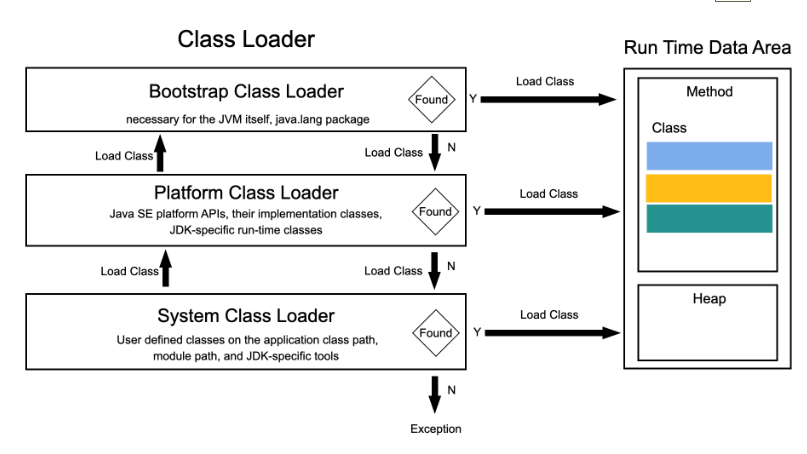
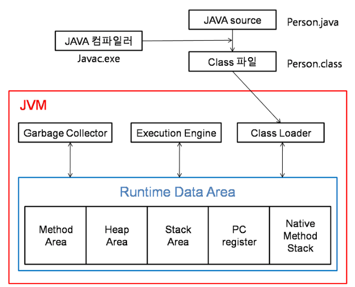

jvm의 소개

jvm (java virtual machine)
1. jvm이란 자바 가상머신으로 자바 어플리케이션을 실행하는 머신이다.
2. 실제 컴퓨터로부터 메모리를 할당 받아 Runtime Data Area를 구성한다.
3. 인터프리터, Jit 컴파일러를 통해 바이트 코드를 각 체제에 맞는 기계어로 해석시켜 실행한다.
4. 어플리케이션의 동적 메모리를 관리한다.

jvm의 구조
 jvm의 구조에는 Class Loader, Run time data area, Exception이 있다.

클래스 로더(Class Loader)

class Loader 특징

1. 위임모델: 자신에게 클래스 로딩 요청이 들어오면 부모인 클래스 로더에게 요청을 보내고 부모가 못찾으면 자신이 클래스를 탐색하는 것이다.

2. 계층구조: 상위 클래스 로더는 하위 클래스에서 볼 수 있지만, 그 반대는 불가능함 클래스 로더의 책임은 분리하고, 클래스 로더는 자신이 책임지는 클래스를 로딩함

Bootstrap Class Loader: 네이티브 코드로 작성하고 jvm에 내장되어 있음. jvm 실행에 필요한 클래스를 로딩함

Platfrom Class Loader: Java SE platform API 등 기본적으로 제공해주는 클래스를 로딩할 때 사용함. Bootstrap Class Loader를 부모로 가짐

System Class Loader: Class Path에 명시된 경로로 클래스를 찾음. Platfrom Class Loader를 부모로 가짐

그래서 소스를 작성하면 .java파일이 생성되고 소스를 컴파일하면 class파일이 생성되고 클래스 로더는 class파일을 묶어서 Runtime Data로 적재한다.

런타임 데이터 구역(Runtime Data Area)

1. jvm을 실행하면 Heap 영역과 Method영역이 생성되고 해당영역들을 모든 스레드들이 공유한다.
2. 마찬가지로 스레드가 시작될 때 PC Register, Stack, Navtive Method Stack가 생성되고 스레드가 종료되면 Heap 영역과 Method영역, PC Register, Stack, Navtive Method Stack이 같이 사라진다.

여기서 Heap은 클래스의 인스터스들과 배열들이 저장되는 공간이다.
Garbage collector라는 동적 메모리 관리 시스템에 의해 관리된다.

Method는 런타임 상수 풀, 필드, 함수, 코드, 클래스, 인터페이스의 구조가 저장되는 공간이다.

-런타임 상수 풀(runtime constant pool)

1. 런타임 상수 풀은 클래스, 인터페이스마다 존재하고 클래스파일의 constant pool 테이블 영역이 저장되는 공간이다.
2. 각 클래스, 인터페이스의 (전역 변수,함수), (인스턴스 변수,함수)에 대한 심볼릭 링크가 존재함.

실행엔진(Execution Engine)
1. jvm에 로드된 class파일은 바이트 코드를 실행 엔진에 제공하고, 정의된 바이트 코드를 그래도 실행 한다. 
2. 로드된 바이트 코드를 실행하는 런타임 모듈이 실행 엔진이다.
3. 인터프리터가 어플리케이션을 시작하는데 사용된다.
4. 어플리케이션을 동작할 때, 코드를 분석해서 bottleneck, hotspot을 탐지하고
여기서 hotspot은 코드에 거의 사용되지 않는 코드는 컴파일하지 않는 특징이 있다.

===클래스 로더, 런타임 데이터 구역, 실행엔진을 통하여 jvm이 여러가지 작업을 수행하는 것을 알 수 있다.

-------------------
자바동작원리
위에 과정과 비슷하다.

1. 자바 코드를 컴파일하면 .class가 된다. 이것을 바이트 코드로 만들면 jvm에서 실행이 가능하다.

2. 다음으로는 컴파일이 되어야하는데 같은 컴파일 플랫폼에서만 실행된다.
예를 들면 원도우 컴파일은 윈도우에서만 실행이 가능하고 리눅스에서는 실행이 불가능하다.

3. 바이트 코드를 해석하는 방식이다. 크게는 interpreter 방식과 jit 방식이 있다.

interpreter 방식은 한줄 씩 해석하는 방법으로 속도가 느리다.
속도를 보완하기 위해 나온것이 jit 방식이다.
그래서 초반에 jvm이 인터프리터를 사용하다가 일정 범위를 넘어가면 jit방식으로 사용 하는 것이다.

4. 클래스 로더는 계층 구조를 이루고 있다.
모델 종류로는 Bootstrap Class Loader, Platfrom Class Loader, System Class Loader가 있다.

5. 클래스 로더에 의해 메모리에 저장된 것들을 실행한다. 명령어를 실행시키는 방식에는 인터프리터, jit가 있다. 