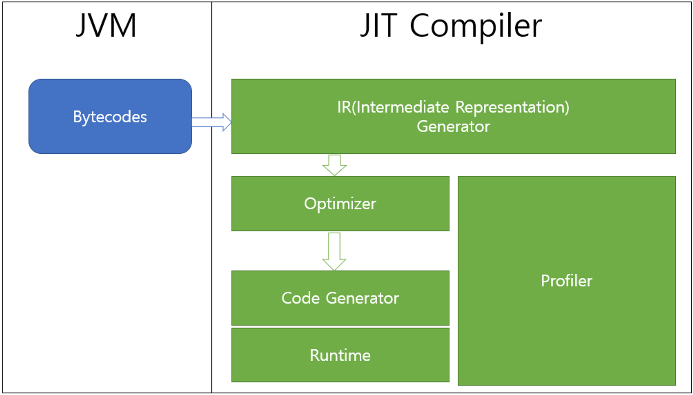

JVM은 무엇인가?
====
>* JVM은 자바 가상 머신으로    
> 자바 어플리케이션을 실행하는 가상머신    
> >실제로 컴퓨터로 부터 JAVA 어플리케이션 실행을 위한 메모리를 할당받아 Runtime Data Area를 구성한다.

-----
>JVM 시작시 Heap 영역과 Method 영역 생성  
> 해당영역을든 모든 스레드들이 공유    
> 각 스레드가 시작될때 스레드마다 PC Register, Stack, Navtive Method Stack 생성 스레드가 종료될 때 사라짐  
> 모든 스레드들이 실행되고 종료되면 JVM이 종료되면서 Heap 영역과 Method 영역 사라짐
>>* PC Register 
>>>* 자바 가상머신이 현재 실행중인 명령어의 주소 저장
>>* Stack
>>>* Frame 이라는 자료구조 저장
>>* Frame 
>>>* 데이터, 반환 값을 저장하는 자료구조, 함수가 호출될때 생성되고 함수가 종료되면 사라짐
>>* Native Method Stack 
>>>* 다른 언어로 작성된 코드를 실행할 때 사용되는 스택
>>* Heap 
>>>* 클래스의 인스터스들과 배열들이 저장되는 공간 
>>>* 가비지 컬렉션이라는 동적 메모리 관리 스스템에 의해 관리
>>* Method 
>>>* 런타임 상수 풀, 필드, 함수, 코드 등 클래스와 인터페이스의 구조가 저장되는 공간
>>* Runtime Constant Pool
>>>* 런타임 상수 풀은 클래스, 인터페이스 마다 존재 클래스 파일의 constant pool 테이블 영역이 저장디는 공간
>>>* 각 클래스, 인터페이스의 전역 변수, 함수, 인스턴스 변수, 함수에 대한 심볼릭 링크가 존재
>>>* 전역 변수와 전역 함수는 컴파일 시점에 할당되어 고정된 값으로 존재, 인스턴스 변수와 인스터스 함수는 심볼릭 링크로 존재하며 실행 시점에 고정된 주소로 변환
>>>* 런타임 상수 풀은 클래스가 생성되어 Heap에 할달될 떄 만들어지며 클래스가 삭제되면 사라짐
---
>* JVM을 사용하면 하나의 비이트 코드로   
모든 플랫폼에서 동작하도록 할 수 있음
>
>* 생성된 바이트 코드는 각자의 플랫폼에 설치되어 있는 자바 가상 머신이 운영체제에 맞는 실행 파일로 바꿔준다.  
>
>
>* 바이트 코드 
>>* 특정 하드웨어가 아닌 가상 컴퓨터(Virtual Machine)에서 돌아가는 실행 프로그램을 위한 이진 표현법으로 하드웨어가 아닌 소프트웨어에 의해 처리되기에 기계어보다 추상적이다.
>* 자바 바이트코드 
>>* JVM이 실행하는 명령어의 형태로 각각의 바이트코드는 1바이트로 구성되지만 몇 개의 파라미터가 사용되는 경우가 있어 총 몇 바이트로 구성되는 경우가 있다.
---
>* JIT 컴파일러  
자바 바이트 코드는 기계가 바로 수행할 수 있는 언어보다는 비교적 인간이 보기 편한 형태로 기술된 것으로 실행 엔진은 이와 같은 바이트코드를 JVM내부에서 기계가 실행할 수 있는 형태로 변경하는데 이때 인터프리터, JIT 컴파일러를 사용한다.     
>인터프리터 방식으로 실행하다 적절한 시점에 바이트코드 전체를 네이티브 코드로 바꾼다. 그 다음부터 인터프리터는  네이티브 코드로 컴파일된 코드를 바로 사용한다. 네이티브 코드를 실행하는 것이 하나씩 인터프리팅 하는 것보다 빠르고, 네이티브 코드는 캐시에 보관하기 때문에 한 번 컴파일된 코드는 계속 빠르게 수행된다.

>
> * JIT 컴파일러는 바이트코드를 우선 중간 단계의 표현인 IR(Intermediate Representation)로 변환하여 최적화를 수행하고 그 다음 네이티브 코드를 생성한다.
---
> 
> * 즉 HotSpot 가상머신은 라인별로 바이트 코드를 읽어 기계어로 변환해 실행하며 기본적으로는 인터프리터를 통해 실행을 하지만 자주 등장하는 바이트 코드일 경우 JIT 컴파일러를 사용해 컴파일을 하는 방법을 통해 실행 방법을 최적화 시킨다.
---
> 

> Bootstrap Class Loader
> * 네이티브 코드로 작성되었으며 JVM에 내장되어 있다.
> * JVM이 시작될 때 실행되며 java.lang package 처럼 JVM 실행에 필요한 클래스들을 로딩한다.

>Platform Class Loader
> * java.lang.ClassLoader의 인스턴스로 Java SE platform API 등 자바에서 기본적으로 제공해주는 클래스를 로딩할 때 사용된다.
> * Bootstrap Class Loader를 부모로 가지고 있다.
> * JAVA 8까지는 Extension Class Loader로 불리다가 모듈 시스템이 도입되면서 Platform Class Loader로 명칭이 바뀌었다.

>System Class Loader
> * java.lang.ClassLoader의 인스턴스로 유저가 작성한 클래스를 로딩할 때 사용된다.
> * ClassPath에 명시된 경로를 통해 클래스를 찾는다.
> * Platform Class Loader를 부모로 가지고 있다.
> * JAVA 8까지는 Applicaiton Class Loader로 불리다가 모듈 시스템이 도입되면서 Platform Class Loader로 명칭이 바뀌었다.

>Class Loader
> * 위임 모델 : 클래스 로더는 기본적으로 위임 모델을 채택한다. 자신에게 클래스 로딩 요청이 들어오면 자신의 부모 클래스 로더에게 클래스 로딩 요청을 보내고 부모 클래스 로더가 클래스를 찾지못하면 그 후에 자신이 클래스를 탐색한다.
> * 계층 구조 : 상위 클래스 로더의 클래스는 하위 클래스에서 볼 수 있지만 그 반대는 불가능 하다. 이러한 계층 구조를 통해 클래스 로더의 책임은 분리하고 클래스 로더는 자신이 책임지는 클래스를 로딩할 수 있다.
---

> JVM은 동적으로 로드, 링크, 초기화 과정을 진행한다.   
> 로딩은 특정 이름을 가진 클래스 또는 인터페이스의 바이트 코드를 찾은 후 클래스 또는 인터페이스를 생성하는 과정이다.     
> JAVA 어플리케이션의 동작은 JVM을 시작한 후 특정 클래스를 런타임 데이터 영역으로 로딩한 후 로딩,링크,초기화 과정을 거쳐 최종적으로 특정 클래스의 public static method void main(String []) 함수를 실행하는 것이다.     
> 해당 과정을 실행하면서 연쇄적으로 다른 클래스들을 로딩,링크,초기화한다.

> JVM 시작
> * JVM이 시작되면 런타임 데이터 영역이 생성되고 그 안에 메소드, 힙 영역이 할당된다. JVM에 내장된 BootStrap Class Loader는 java.lang.package 처럼 JVM 실행에 필요한 클래스들을 메소드 영역으로 로딩한다. System Class Loader를 통해 실행한 클래스를 메소드 영역으로 로딩한다.

> 로딩
> * 클래스 또는 인터페이스의 생성은 해당 클래스의 필드, 메소드, 런타임 상수 풀 등 클래스가 가지고 있는 바이트코드를 찾은 후 JVM의 메소드 영역에 구성하는 것을 의미한다. 클래스 로더를 통해 로딩을 진행하며 A 클래스를 로딩했을 때 A 클래스의 부모 클래스가 존재할 경우 먼저 부모 클래스를 로딩한다.

> 링크
> * 검증 : 로딩된 바이트 코드가 JVM 명세를 따르고 있는지 검증하는 과정
> * 준비 : 정적 필드를 각 유형의 기본값으로 초기화하는 과정 - Int type은 0으로, reference type은 null로 초기화 된다.
> * 분석 : 클래스의 런타임 상수 풀 안에 있는 Symbolic Reference를 고정된 주소 값으로 바꾸는 과정

> 메소드 오버라이딩
> * invokeinterface 또는 invokevirtual 이라는 바이트 코드와 특정 메소드를 연결할 때 , 스택 최상단에 올라와 있는 객체의 타입에 따라 메소드를 결정한다. 즉 Java의 동적 바인딩은 실행 시점에 클래스의 런타임 상수 풀에 있는 Symbolic Referenc를 고정된 주소 값으로 바꾸는 것이며 이 때 고정된 주소 값을 선택하는 기준은 스택 위에 올라와 있는 객체의 타입이다.

> 초기화
> * 클래스 초기화 함수를 실행한다. 클래스에 작성된 static 초기화 함수를 모두 합쳐 한꺼번에 실행한다. 초기화 과정은 로딩-검증-준비 과정이 모두 끝났을 때 한번만 실행된다.

> JVM 종료
> * 일부 스레드가 Runtime 클래스의 종료 메서드나 중지 메서드, 클래스 시스템의 종료 메서드를 호출하면 JVM 종료 또는 중지 작업이 Security Manager에 의해 허용된다.

# 정리
* JDK에 있는 자바 컴파일러를 통해 java 파일을 바이트 코드(class 파일)로 만들고, JRE에서 바이트 코드를 실행시키면 JVM이 시작되면서 JVM 위에서 바이트 코드가 기계어로 해석되어 실행된다.

* JVM의 명세를 따르는 가상 머신은 모두 JVM이다. 대표적으로 Oracle의 Hotspot이 존재한다.

* JVM의 런타임 데이터 영역에는 모든 스레드들이 공유하는 Heap, Method 영역, 각 스레드 마다 존재하는 Stack, PC Register, Native Method Stack이 존재한다.

* HotSpot의 JAVA 실행 엔진은 일반적으로 한줄 씩 바이트 코드를 읽어 인터프리터를 통해 기계어로 번역하며 자주 사용되는 바이트 코드는 JIT 컴파일러를 통해 캐시에 미리 컴파일 하는 방식으로 실행 엔진을 최적화 시킨다.

* 클래스 로더에는 BootStrap, Platform, System 클래스 로더가 존재하며 각 클래스 로더들은 위임 모델과 계층 구조를 지닌다.

* JVM은 동적으로 로딩,링크,초기화 과정을 진행하며 java 어플리케이션의 실행은 특정 클래스를 로딩, 링크, 초기화 과정을 거친 후 해당 클래스의 main method를 실행하는 것을 의미한다.

* Java의 동적 바인딩은 실행 시점에 클래스의 런타임 상수 풀에 있는 Symbolic Referenc를 고정된 주소 값으로 바꾸는 것이며 이 때 고정된 주소 값을 선택하는 기준은 스택 위에 올라와 있는 객체의 타입이다