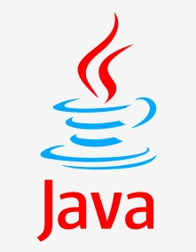
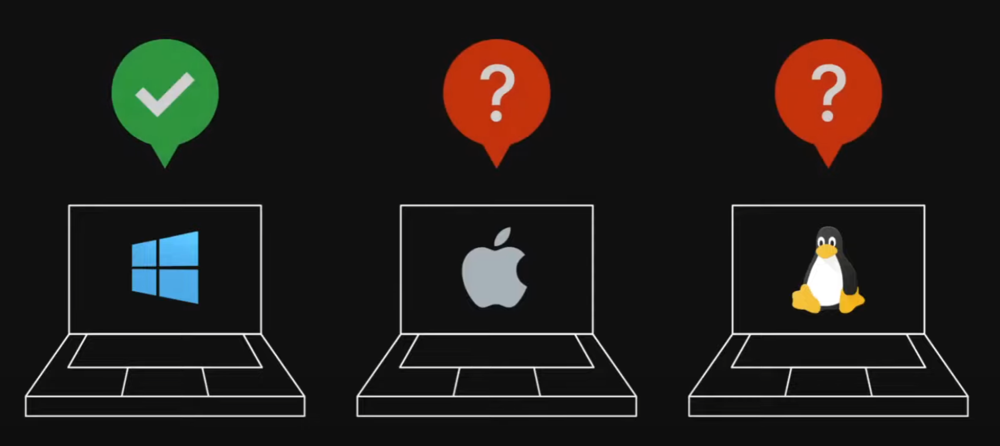
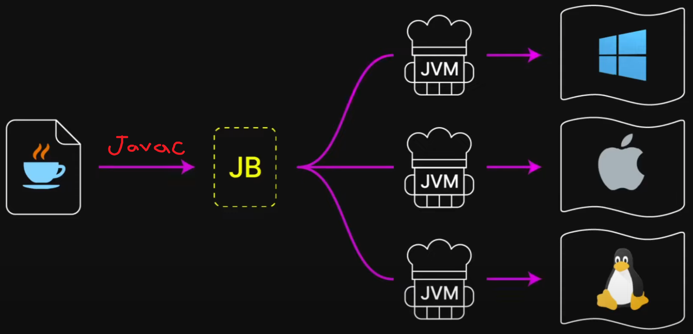
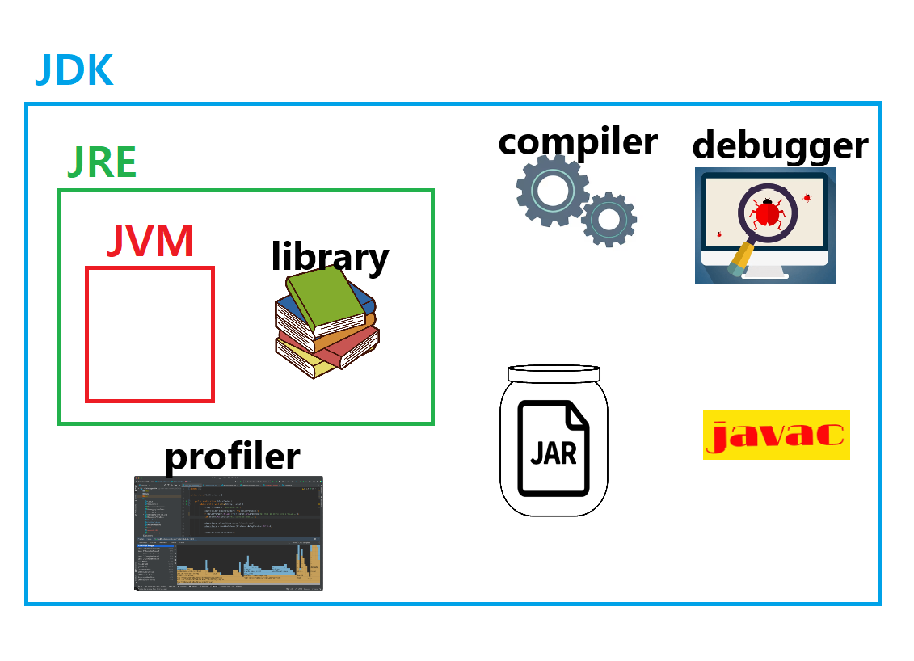
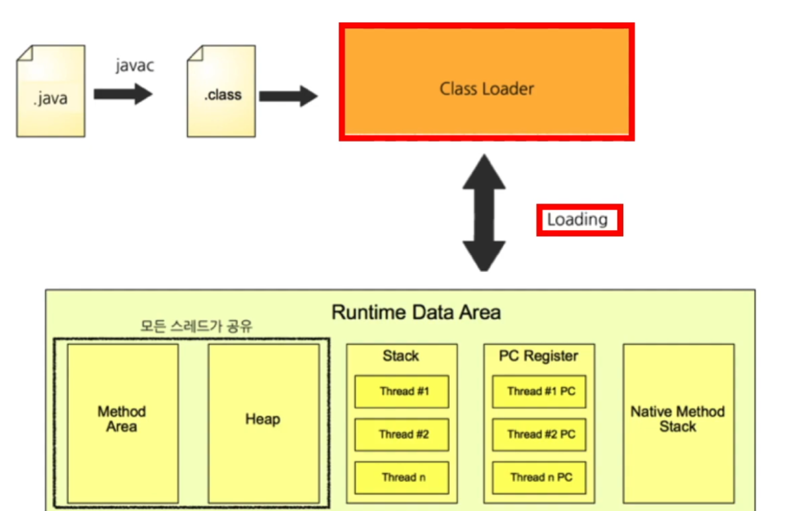

# Java에 대하여

## 1. Java란?

- Java는 1995년에 제임스 고슬링이라는 선생님과 여러 연구자들이 썬마이크로시스템즈에서 함께 개발하여 발표한 **객체 지향**프로그래밍 언어이다.
- 지금은 Oracle이라는 미국 2위 소프트웨어 기업에서 관리, 개발을 이어가고 있다.

## 2. Java의 특징, JVM이란 무엇이고, JDK와 JRE에 대하여

- 흔히 수업을 듣다 보면 'Java의 특징이 뭐냐?' 또는 '다른 언어랑 다른 점이 뭐냐?' '모든 OS에서 돌릴 수 있는 게 무슨 말이냐?' 등등 이런 질문들을 마주하게 됩니다.  
  자바는 클래스 / 객체의 개념을 장착하고 객체지향적인 프로그래밍에 기반을 두고 개발된 언어인데, 객체지향적 개발을 많이 해보다 보면 아 이래서 객체지향이라 하는구나가 이해될 수 있지만 처음엔 이해하기 난감했습니다. (객체지향프로그래밍1, 2수업때 C++로 배울 때도 솔직히 느낌 안왔음)
- 나름의 주관대로 자바에 대해, 그리고 JVM이란 뭔지, 우리가 앞으로 자주 듣고 사용하게 될 JDK는 뭐고 JRE는 뭔지에 대해 조사해봤습니다.

### 2 - 1.

### JVM이란?

> JVM(Java Virtual Machine) 은 말 그대로, 자바는 가상 머신을 사용한다는 의미입니다.
>
> > 컴퓨터는 우리가 개발에 사용하는 C언어나, C++, C#, Python, Java, Kotlin, Ruby, JavaScript(JS) 와 같은 개발할 때(사람이 컴퓨터에게 일을 시킬 때) 사용하는 언어인 고급 언어(high level language)를 컴퓨터가 알아들을 수 있는 이진 형태(0과 1만의 조합)의 데이터로 번역해줘야 합니다. 이 번역을 컴파일(Compile)한다고 합니다. 비슷한 개념의 인터프리터(interpreter)의 번역도 있는데, 이건 제쳐두겠습니다.
>
> > 보통 Java를 다른 언어와 비교를 할 때 C언어와 비교를 많이 하는데, C언어와 가장 큰 차이점은 VM(Virtual Machine), 즉 가상 머신을 사용한다는 것입니다. 가상 머신이 왜 필요했는지에 대해 알아볼게요
>
> > 
> > 우선 우리가 아는 컴퓨터는 프로세서(CPU)마다 각각 다른 명령어를 알아듣습니다. 이게 무슨 말이냐면, 예를 들어 1 + 1이라는 명령어가 Intel CPU에서는 11110001 이라면 애플의 M1칩 CPU에서는 00011101입니다.(실제로 그렇다는 건 아니고 명령어와 해석 체계가 다르다는 겁니다.) C언어로 1 + 1을 해주는 코드를 짜서 컴파일을 진행하면 IntelCPU를 가진 윈도우 컴퓨터는 11110001으로 변환해줄 것이고, M1칩 맥북에서는 00011101로 바뀐다는 의미입니다. 만약 맥북에 깔린 컴파일러로 윈도우 Intel칩셋을 장착한 머신에서 컴파일을 해버리면 1+1이 아닌 전혀 다른 명령을 내리게 되는 것입니다. 이처럼 기계(정확히는 OS와 프로세서)마다 다른 컴파일러를 가져야 했습니다.

> > 그런데 가상머신이라는 걸 쓰게되면 아래와 같은 형태가 됩니다.
> > 
> > 우선 우리가 작성한 Java 코드가 JavaC(자바컴파일러)를 통해 JB라는 바이너리 코드로 우선 바뀌고, 이 코드를 가상머신에 한번 더 넣어 각 머신에 맞는 기계어로 변환을 해줍니다.
> >
> > 이렇게 되면 각 머신에 JVM만 장착(설치)되어 있다면 Java로 작성한 코드를 어느 OS이던, 어느 머신이던 코드의 의도와 맞게 동작을 하게 되는 거죠. 때문에 JVM은 각 OS에 맞는 번역가이드를 가지고 있다고 생각하면 됩니다. 물론 단점도 있는데, 원래 컴파일을 한번만 하던 C언어와는 다르게, 번역과정이 한번 더 추가되기 때문에 성능적으로 조금 더 느리다는 평가가 있습니다.

그런데 우리는 개발하다보면 JDK는 뭐고, JRE는 뭔지 알아야 할 때가 있습니다. JVM에 대해 알아봤으니, JDK와 JRE가 무엇인지 살펴보겠습니다.

### 2 - 2.

### JDK란 그리고 JRE란?

> JDK(Java Development Kit) : 자바 개발 도구 키트 라는 뜻입니다.  
> 우리가 개발한 언어는 위의 과정에서 봤다시피, javac와 JVM을 거쳐 기계어로 해석되게 되는데, 이러한 과정에서 필요한 javac와 JVM 뿐만 아니라, JRE와 디버거, 자바 실행파일로 만들어주는 jar, 프로그램의 성능을 모니터링하는 데 필요한 프로파일러 등, 프로그램을 만드는 데 필요한 과정에 전반적으로 도움을 주는 도구들의 모음집이라고 생각하면 됩니다.
>
> JRE에 대한 설명을 먼저 하겠습니다.  
> JRE(Java Runtime Environment) : 자바 실행 환경 이라는 뜻을 가지고 있습니다. 우리가 작성한 자바 코드를 실제로 실행하는 데 필요한 여러 라이브러리, 클래스를 해석할 수 있는 클래스로더 등을 포함한 "실제 실행에 필요한 재료 모음집"이라고 생각하면 됩니다.
>
> JDK에는 JRE가 포함되어 있는데, 여기까지를 그림으로 다시 보면 아래와 같습니다.
> 

## 3. Java의 프로그램이 실행될 때, JVM 내부에서 일어나는 일 (메모리 구조)

### 프로그램을 실행하면, 프로그램이 저장된 보조기억장치(하드디스크 / ssd)에서 프로그램을 가져다 컴퓨터의 주 기억장치 즉 메모리에 적재합니다.

### 적재되어 실행중인 프로그램을 프로세스라고 합니다.

메모리는 CPU와 데이터를 주고받으며 데이터를 연산 / 처리하여 프로그램을 동작시킵니다.
이 때 Java로 작성된 프로그램이 JVM의 메모리상에서 어떻게 처리되는지 설명합니다.

자바는 Class를 선언해 class에 따라 객체(인스턴스)를 생성하여 각 객체가 상호작용하여 프로그램이 동작하도록 하는 "객체지향적"인 프로그래밍 언어입니다. Java로 작성된 프로그램은 읽어오기, 처리, 저장하기의 모든 동작이 class를 정의함으로써 이루어집니다. 모든 동작은 class내에서 정의, 선언하며 이 class를 바탕으로 JVM은 해야 할 일을 하나씩 해석해 나갑니다.

javac를 통해 1차 컴파일된 JB(자바 바이트코드)를 '클래스로더'가 해석하여 해당 내용을 JVM 메모리로 옮깁니다.

Runtime Data Area가 바로 메모리 구조를 나타낸 부분인데, 크게 다섯 가지 영역으로 구성되어 있습니다.

- Stack : 메서드에 입력되는 파라미터, 여러 주소값, 리턴값이나 연산값들이 저장되는 영역. 메서드 호출 시 실행에 필요한 공간을 이 Stack 영역에 임시로 할당되었다가 메서드 종료 시 다시 회수됩니다.
- PC Register : JVM은 스택(후입 선출) 기반의 가상 머신입니다. 명령어들이 저장되어 다음 실행할 명령을 갖고 있습니다.
- Native Method Stack : 미들 웨어로 불리는 OS의 커널이 독자적인 권한을 갖고 있으며, Java 이외의 프로세스에서의 메서드들에 대한 정보를 담습니다. JVM에서 이를 필요로 한다면 Java Native Interface를 통해 바이트코드로 해석하기도 합니다.
- Heap : 가비지컬렉터(Garbage Collector, 종료된 후 쓸모없어진 리소스들 수거해서 다른 프로그램들에 피해가 없도록 없애줌)가 가비지를 모으는 영역, Java에서의 new 문법을 통해 인스턴스 생성 시 이 Heap 영역에 할당됩니다. 단, 참조변수의 경우에는 Heap에 할당이 바로 되지 않고, 그 주소값만 저장하게 됩니다.
- Method Area : 해석된 클래스를 처음 적재할 때 초기화되는 대상인스턴스를 올려둡니다.(필드 및 메서드 정보와 해당 class의 타입 등)
