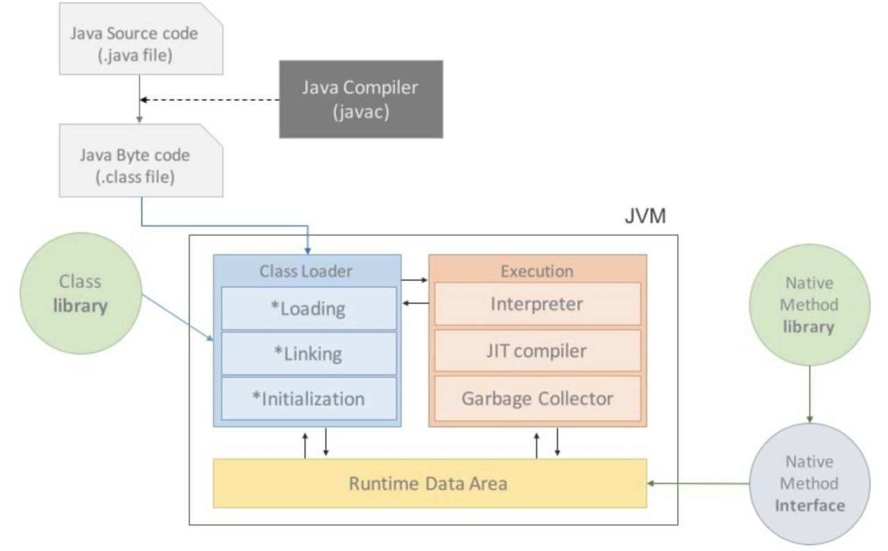
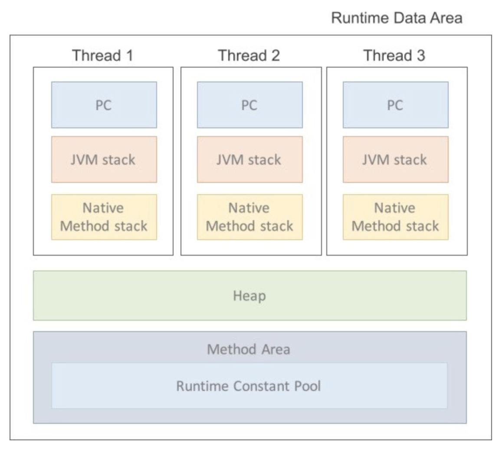

# 1. JVM

## JVM이란 Java Virtual Machine, 자바 가상 머신의 약자를 따서 줄여 부르는 용어

## JVM의 특징
1. 컴파일된 바이트 코드를 기계가 이해할 수 있는 기계어로 변환
2. 스택 기반의 가상 머신
3. 메모리 관리와 GC를 수행

## JVM의 구조

### JVM의 구조는 크게 Class Loader, Runtime data areas, Execution Engine, GC로 구분됌

* `Class Loader`는 클래스 파일을 Runtime Data Area의 메서드 영역으로 불러오는 역할
* `Execution Engine`은 class파일과 같은 ByteCode를 실행 가능하도록 해석
* `GC(Garbage Collector)`는   메모리 관리 기법 중 하나로, Heap 영역에 배치된 객체들을 관리하는 모듈
* `Runtime Data Area`는 런타임 시 클래스 데이터와 같은 메타 데이터와 실제 데이터가 저장되는 곳 (Java 메모리 공간)

## Runtime Data Area는 또다시 Method Area, Heap, PC Registers, Java Stacks, Native Method Stacks로 나눠짐

* (Java는 멀티 스레드 환경으로 모든 스레드는 Heap, Method Area를 공유함)
* `PC Register`
 * JVM은 스택 기반의 가상 머신으로, CPU에 직접 접근하지 않고 Stack에서 주소를 뽑아서 가져옴. 가져온 주소는       PC Register에 저장
 * 따라서, PC Register는 현재 어떤 명령을 실행해야 할 지에 대한 기록을 담당
* `JVM Stacks`
 * 호출된 메서드의 파라미터, 지역 변수, 리턴 값 및 연산 값 등이 저장되는 영역
 * 프로그램 실행 시 임시로 할당되었다가 메서드를 빠져나가게 되면 소멸되는 특성의 데이터들이 저장되는 영역
 * 메서드 호출 시마다 스택에 각각의 스택 프레임이 생성되고, 수행이 끝나면 스택 포인트에서 해당 프레임을 제거
* `Native Method Stacks`
 * Java 이외의 언어에 제공되는 Method의 정보가 저장되는 공간 / Java Native Interface를 통해 바이트 코드로 저장
 * Kernel이 자체적으로 Stack을 잡아 독자적으로 프로그램을 실행시키는 영역
* `Heap`
 * GC(가비지 컬렉션)의 대상이 되는 영역
 * 객체를 동적으로 생성하게 되면 인스턴스가 Heap 영역의 메모리에 할당됌
 * 단, 레퍼런스 변수의 경우, Heap에 인스턴스가 저장되는 것이 아닌 포인터가 저장
* `Method Area`
 * 클래스 정보를 처음 메모리에 올릴 때 초기화되는 대상을 저장하기 위한 영역
 * 올라가는 정보는 다음 내용과 같다.
  * `Field Information` -> 멤버 변수에 대한 정보 (이름, 타입, 접근 지정자 등)
  * `Method Information` -> 메서드에 대한 정보 (이름, 리턴 타입, 파라미터, 접근 지정자 등)
  * `Type Information` -> Class 인지 Interface 인지 혹은 Type의 속성, 이름, super class의 이름 등, 또한 Method Area에는 상수형을 저장하고 중복을 막는 Runtime Constant Pool이 존재